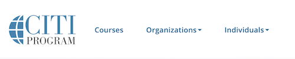
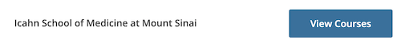
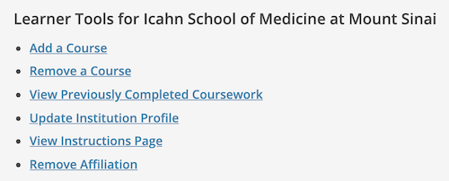
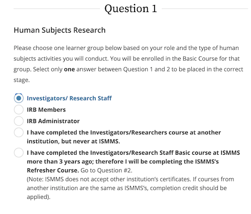
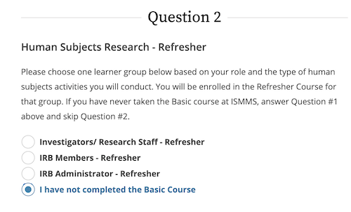
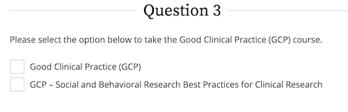
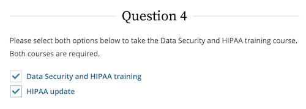
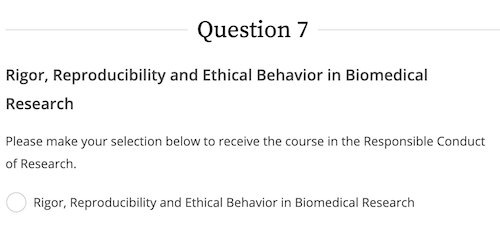
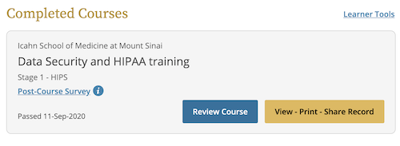
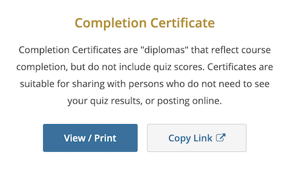

# Completing CITI Trainings

Before getting onboarded to HPIMS, you must complete the required CITI Trainings by following [this link](https://www.citiprogram.org/?pageID=668) and logging in with your Mt Sinai credentials.

On the home page, navigate to the courses page:

Select the institution (Mt Sinai) and then click "add courses":

HPIMS requires the Investigators/Research Staff, Data Security and Training, HIPAA Update, and Rigor, Reproducibility and Ethical Behavior in Biomedical Research, as well as Good Clinical Practice if applicable.

After clicking "Add a Course", you are led to a form with 10 questions. Completing this form will place you in a "learner group" and add the appropriate courses. Questions 1, 2, 3, 4, and 7 must be answered; the rest can be left blank as they do not pertain to the required courses for HPIMS.

**Question 1**: Choose the "Investigators/Research Staff" Basic Course:

**Question 2**: Choose "I have not completed the basic course":

**Question 3**: If you are required to complete the "Good Clinical Practice" module, check it to add the course (not applicable for those who do not work in a clinical setting):

**Question 4**: Select both "Data Security and HIPAA Training" and "HIPAA Update":

**Question 7**: Select "Rigor, Reproducibility, and Ethical Behavior in Biomedical Research"

After submitting the questionnaire, you will be redirected back to the courses page; under "Active Courses", you should now see Investigators/Research Staff, Data Security and Training, HIPAA Update, and Rigor, Reproducibility and Ethical Behavior in Biomedical Research, as well as Good Clinical Practice if applicable. Complete all the required modules for each course.

After completing the required modules for a course, return to the courses page; for each course, click the option to view, print, or share the record:

Finally, print out the completion certificate (save as a .pdf), and upload it via the HPIMS "Research Regulatory Documents" Form, along with the Data Use Agreement and your CV.

