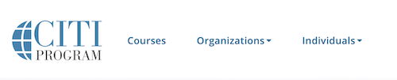
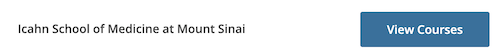
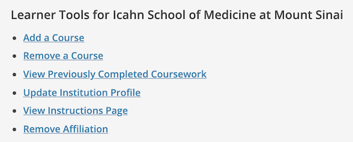
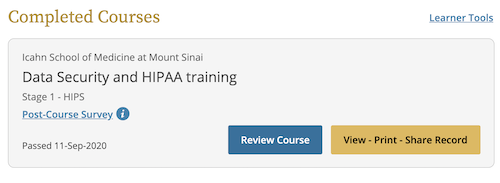
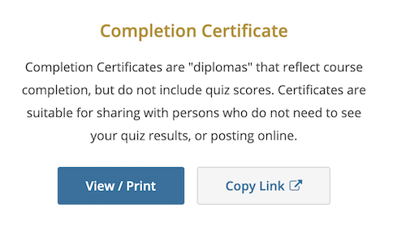

# Completing CITI Trainings

Before getting onboarded to HPIMS, you must complete the required CITI Trainings by following [this link](https://www.citiprogram.org/?pageID=668) and logging in with your Mt Sinai credentials.

On the homepage, navigate to the courses page:

Select the institution (Mt Sinai) and then click "add courses":

Fill out the questionnaire to add the required courses, depending on your situation. HPIMS requires the Investigators/Research Staff, Data Security and Training, HIPAA Update, and Rigor, Reproducibility and Ethical Behavior in Biomedical Research, as well as Good Clinical Practice if applicable.

After completing the required modules for a course, view the record and print out the completion certificate (save as a .pdf), and upload it via the HPIMS "Research Regulatory Documents" Form, along with the Data Use Agreement and your CV.

