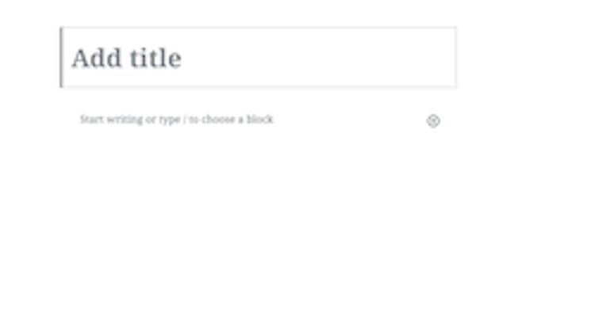
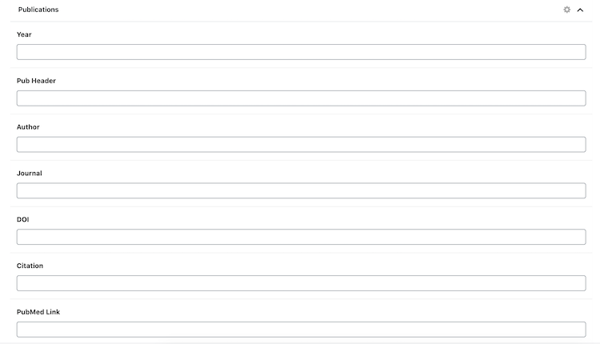
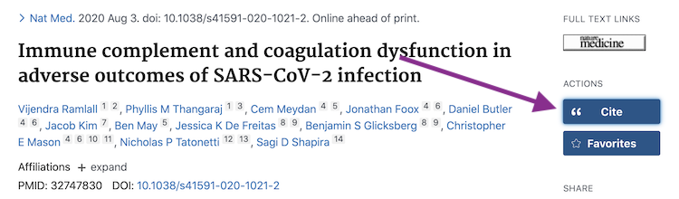
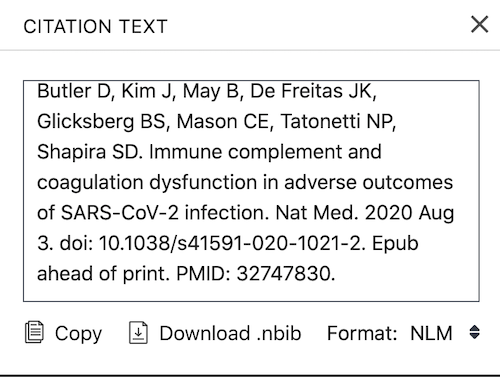

## Updating the Website

Once you have the login credentials, proceed to the [Wordpress dashboard](https://glicksberglab.com/wp-admin/index.php) to preview and publish new pages.

### Adding Publications

Navigate to the "Add New" page under the "Publications" section of the left sidebar:

There you will see empty fields for the title and abstract as well as various metadata fields below:

The title and abstract fields at the top can be copied and pasted directly from the PubMed article preview. Similarly, the year, journal, and PubMed Link fields are self-explanatory.

**Pub Header**: On the PubMed page for the article, click the "Cite" action and copy the citation text to the clipboard before pasting it in the Pub Header field.

**Author**: The authors can be copied from the first sentence of the citation text.

**DOI**: The doi can be copied from the fourth sentence of the citation text, directly after the date of publication.

**Citation**: Identical to Pub Header.

**Article Link**: On the PubMed page for the article, copy the link address by right clicking the button under the  "Full Text Links" section.

**Download Paper**: Upload a .pdf file of the article.
