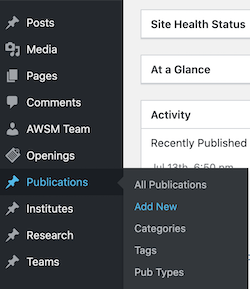
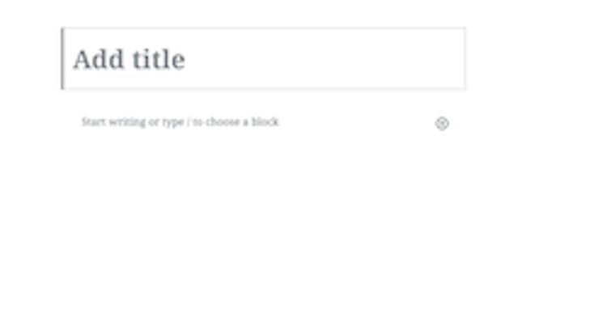
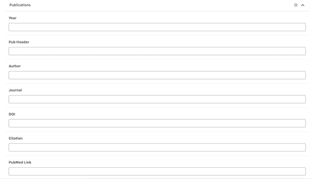
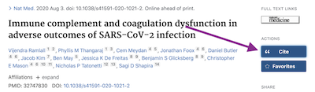
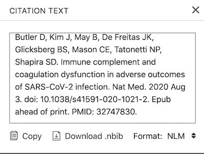
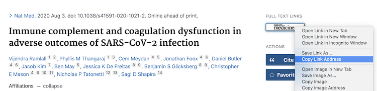
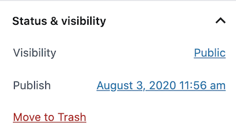
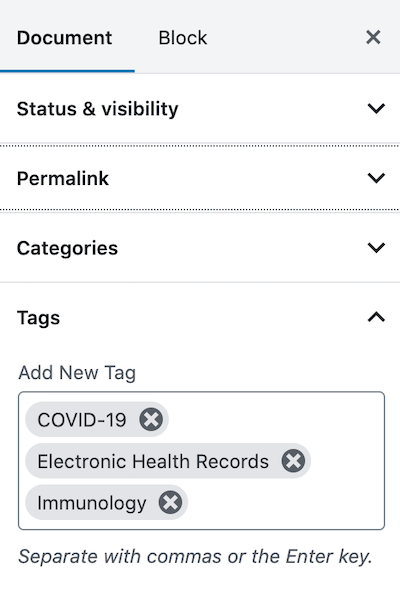
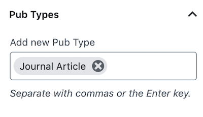
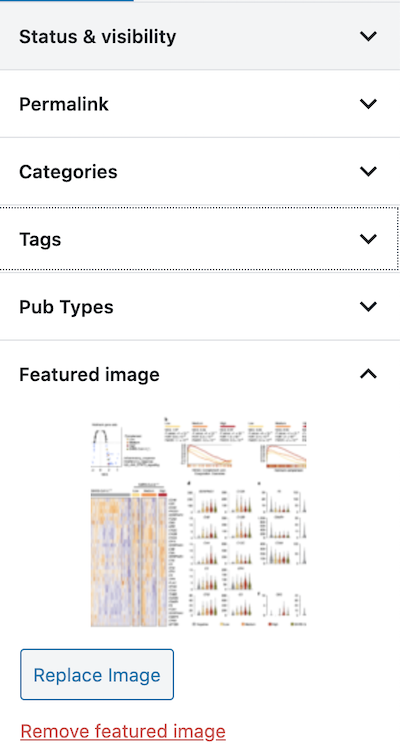

## Updating the Website

Once you have the login credentials, proceed to the [Wordpress dashboard](https://glicksberglab.com/wp-admin/index.php) to preview and publish new pages.

### Adding Publications

Navigate to the "Add New" page under the "Publications" section of the left sidebar:

There you will see empty fields for the title and abstract as well as various metadata fields below:

The title and abstract fields at the top can be copied and pasted directly from the PubMed article preview. The main block text block should be filled with the abstract from the PubMed page.

**Year**: Year of publication.

**Pub Header**: See below instructions on copying the citation text into the "Citation" field. In the Pub Header field, paste the citation text minus the article title.

**Author**: The authors can be copied from the first sentence of the citation text.

**Journal**: Journal in which the article appeared.

**DOI**: The DOI can be copied from the fourth sentence of the citation text, directly after the date of publication. For example, consider the following citation text:

> Ramlall V, Thangaraj PM, Meydan C, Foox J, Butler D, Kim J, May B, De Freitas JK, Glicksberg BS, Mason CE, Tatonetti NP, Shapira SD. Immune complement and coagulation dysfunction in adverse outcomes of SARS-CoV-2 infection. Nat Med. 2020 Aug 3. **doi: 10.1038/s41591-020-1021-2**. Epub ahead of print. PMID: 32747830.

The DOI is **10.1038/s41591-020-1021-2**. The DOI is also listed under the title and authors on the PubMed page for the article.

**Citation**: On the PubMed page for the article, click the "Cite" action and copy the citation text to the clipboard before pasting it in the Pub Header field.

**Article Link**: On the PubMed page for the article, copy the link address by right clicking the button under the  "Full Text Links" section.

**PubMed Link**: Include a link to the PubMed page for the article.

**Download Paper**: Upload a .pdf file of the article.

On this same page, there is a sidebar on the right hand side which contains more fields which must be completed.

**Publication Date**: Under the "status and visibility" option, there is a hyperlink with the publication date. Clicking on this link directs to a popup calendar which allows you to select the publication date of the article.

**Tags**: Verify with Ben before adding tags relating to the subject of the article.

**Pub Types**: Type and select the relevant publication type: Book Chapter, Conference Paper, Journal Article, Perspective, Review, etc.

**Featured Image**: Select an image related to the article, by either uploading a new file or choosing an image from the site's gallery.

